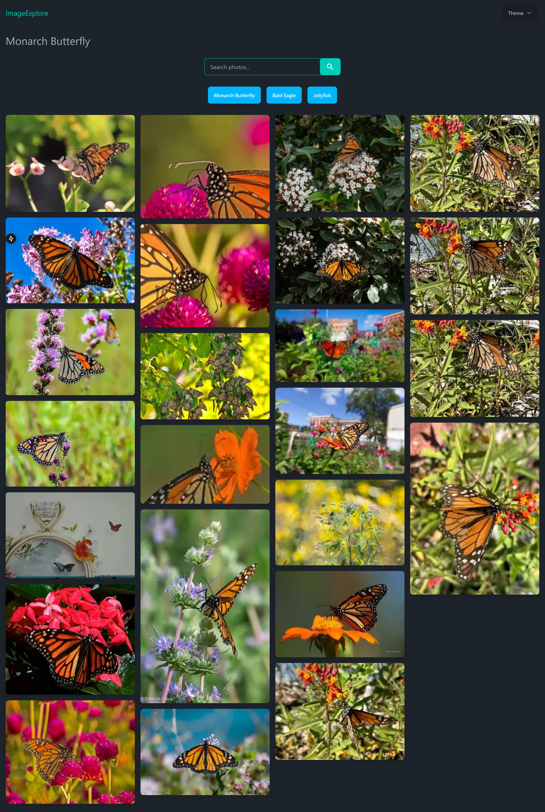
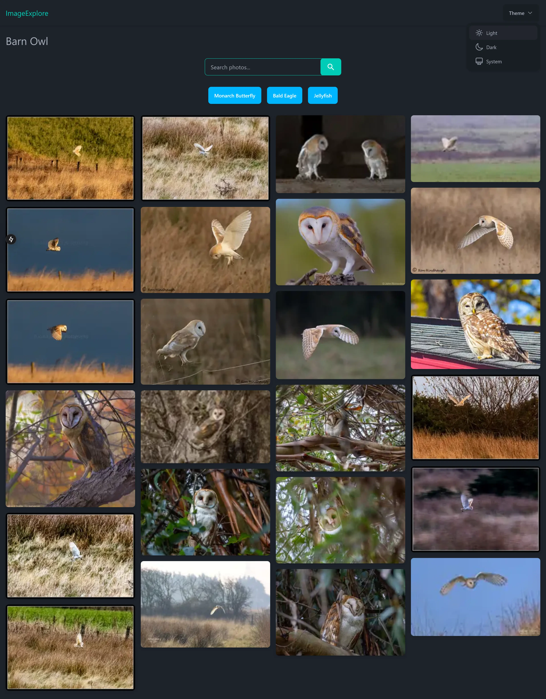

# ImageExplore

## Overview

This is one of my projects from the [Treehouse](https://teamtreehouse.com/) Full-Stack JavaScript techdegree certificate. I redid it from scratch using **Next.js**, **TypeScript**, **TailwindCSS**, **DaisyUI**, and the **Thumbhash** library. It is a photo gallery fetches 24 photos from the **Flickr API** based on predefined topics or user search queries.

## Features

- **Topic-based photo gallery**: Displays photos based on predefined topics when the page loads.
- **Search functionality**: Users can search for photos using a search bar.
- **Blurred image placeholders**: Uses Thumbhash to show a blurred preview before the full image is loaded.
- **Responsive design**: Fully responsive layout built with TailwindCSS and DaisyUI.

## Technologies Used

- **Next.js**
- **TypeScript**
- **TailwindCSS**
- **DaisyUI**
- **Thumbhash**
- **Flickr API**

## API Reference

The application uses the [Flickr API](https://www.flickr.com/services/api/) to generate the photo gallery.

## Example

Here is a preview of the app:

## Acknowledgments

- Thanks to the [Treehouse](https://teamtreehouse.com/) coding community for providing invaluable resources and support.
- Thanks to the creators of the [Flickr API](https://www.flickr.com/services/api/)!
- Thanks to [alkhalifi design and Flaticon](https://www.flaticon.com/free-icons/ui) for awesome icons!
